# Mystery Shack — AI Agent Council 🌲🔭

Welcome to the **Mystery Shack AI Agent Council**! Styled around the cast of *Gravity Falls*, this directory contains a complete, portable, and vendor-agnostic 7-member virtual software engineering team designed to research, architect, and validate features inside your project.

Rather than letting an agent write sprawling, uncoordinated changes, this council enforces strict planning, multi-stage dual-gate reviews, structural checks, performance audits, and security vulnerability scans.

---

## 🛠️ How to Install & Use

### 1. Copy the Skill Folder
Copy this entire directory (the `skills` folder) into your project's `.agent/skills/` directory (e.g. `.agent/skills/mystery-shack/`).

### 2. Find the Three Journals (Establish Your Project Rules)
To support complex projects or monorepos, the council enforces rules split across three distinct Journals:
- **Journal 1 (`JOURNAL_1.md`)**: Defines Infrastructure, Docker, and Security Rules.
- **Journal 2 (`JOURNAL_2.md`)**: Defines API Contracts, Schemas, and DB Migrations.
- **Journal 3 (`JOURNAL_3.md`)**: Defines Core Application Logic & Code Styles (this serves as your primary template).

Copy these files into your project, or combine their guidelines into a single **`AGENT.md`** file at your project's root!

### 3. Configure Your Project Rules
Open your newly created `AGENT.md` (or individual Journals) and replace the brackets `[]` with your project's specific **Tech Stack**, **Core Tools**, and **Immutable Architectural Laws**.

> 💡 **How it Works**: When the council is activated, Stan (Standards) and Dipper (Skeptic) will dynamically load and parse these Journals (or `AGENT.md`). If you write *"No custom loops are allowed—use map/filter/reduce"*, Stan will strictly reject any code proposal from McGucket or Ford that violates this law!

---

## 👥 Meet the Council

```mermaid
flowchart TD
    Ford["🖐️ **Ford (Orchestrator)**<br/>The Gatekeeper, Planner & coordinator"]

    subgraph Tier1 ["Primary Gatekeepers"]
        Dipper["🌲 **DIPPER (Skeptic)**<br/>Analyzes scope creep, risks, & edge cases."]
        Stan["💰 **STAN (Standards)**<br/>Enforces code compliance in local AGENT.md."]
        McGucket["⚙️ **MCGUCKET (Architect)**<br/>Reviews structure, types, patterns, and testing."]
    end

    subgraph Tier2 ["Parallel Review Council"]
        Pacifica["💎 **PACIFICA (Code Quality)**<br/>Enforces style & naming conventions."]
        Rumble["🕹️ **RUMBLE (Performance)**<br/>Audits execution speeds, N+1s, & SQL safety."]
        Soos["❓ **SOOS (Docs/Gaps)**<br/>Gaps analysis, PRD coverage, README validation."]
        Mabel["🌠 **MABEL (Usability/DX)**<br/>Reviews API usability & error clarity."]
    end

    subgraph OutOfBand ["Out-of-Band Audit"]
        Bill["👁️ **BILL CIPHER (Adversarial)**<br/>Unblocked audit logs.<br/><b>NEVER blocks.</b>"]
    end

    Ford --> Dipper
    Ford --> Stan
    Ford --> McGucket

    Dipper --> Pacifica
    Stan --> Rumble
    McGucket --> Soos
    McGucket --> Mabel

    McGucket -.- Bill

    style OutOfBand stroke:#ffd700,stroke-dasharray: 5 5,fill:#1a1a00
    style Bill fill:#2b2600,stroke:#ffd700,color:#fff
```



### 🔄 Architectural Pipeline Sequence Flow
This sequence flow represents how the council acts, reviews, and validates code changes over time across your software development phases:

```mermaid
sequenceDiagram
    autonumber
    actor Dev as [DEVELOPER]
    participant Ford as [FORD]
    participant Dipper as [DIPPER]
    participant Stan as [STAN]
    participant Council as [COUNCIL]

    Dev->>Ford: 1. Task
    Ford->>Dipper: 2. Review
    Note over Dipper: (Risk Audit)<br/>[verdict]
    Dipper-->>Ford: 3. Response
    Ford->>Stan: 4. Mandates Check
    Note over Stan: (Laws Audit)<br/>[verdict]
    Stan-->>Ford: 5. Response
    Ford->>Council: 6. Consensus / Consensus Gate

    rect rgb(20, 30, 45)
        Note over Council: <b>[ PARALLEL REVIEW ]</b><br/>• MCGUCKET (Arch)<br/>• RUMBLE (Perf)<br/>• PACIFICA (Quality)<br/>• MABEL (Usability)<br/>• SOOS (Docs)<br/><br/><b>[ OUT-OF-BAND ]</b><br/>• BILL (Validator)
    end

    Council-->>Ford: 7. Final Sign-off (Unanimous PASS)
    Ford-->>Dev: 8. Report
```



---

## Active — Currently Deployed

| Character                       | Role                                                                                                                        | Skill File         |
|---------------------------------|-----------------------------------------------------------------------------------------------------------------------------|--------------------|
| 🖐️ **Ford** (Great Uncle Ford) | Orchestrator — writes plans, coordinates the team, owns final reporting                                                     | `team/ford.md`     |
| 🌲 **Dipper**                   | Skeptic — pre-execution prompt safety, injection risk, scope creep, edge cases                                              | `team/dipper.md`   |
| 💰 **Stan**                     | Standards Guardian — enforces local `AGENT.md` mandates, binary ✅ PASS / ❌ FAIL, no exceptions                              | `team/stan.md`     |
| ❓ **Soos**                      | Documentation & Gap Analysis — PRD/requirements coverage, missing docs, README generation                                   | `team/soos.md`     |
| ⚙️ **McGucket** (Fiddleford)    | Systems Architecture Review — code structure, design pattern compliance                                                     | `team/mcgucket.md` |
| 🕹️ **Rumble McSkirmish**       | Performance Audit — execution speed, database efficiency, scaling bottlenecks                                               | `team/rumble.md`   |
| 💎 **Pacifica Northwest**       | Code Quality & PR Review — style consistency, naming conventions, and dead code elimination                                 | `team/pacifica.md` |
| 🌠 **Mabel Pines**              | Developer Experience (DX) — API ergonomics, naming consistency, friendly error clarity                                      | `team/mabel.md`    |
| 👁️ **Bill Cipher**             | Adversarial Validator — security audit, vulnerability scanning, and chaos review — **REVIEW ONLY, NEVER IN APPROVAL CHAIN** | `team/bill.md`     |

### 📊 Roster JSON Deliverables & Verdict Value Reference
This reference sheet defines the schemas and exact string literal constraints of the JSON deliverables returned by each active agent. Parsing pipelines, scripts, and CI/CD tools can use this to programmatically process agent verdicts.

```text
                      [STAN] (Standards)
                     "tech_stack_match" 
             ┌─────────── "verdict" ───────────┐
             │                                 │
     "dipper_verdict"                    "overall_verdict"
             │                                 │
    [FORD] (Orchestrator)              [MCGUCKET] (Architecture)
             │                                 │
     "security_gate"                     "test_coverage"
             │                                 │
             └─────────── "verdict" ───────────┘
                     "injection_risk"
                    [DIPPER] (Skeptic)
```

- **Standards (`Stan`)**: Outputs validation states on tech stacks, laws, inputs, and secrets. Verdict resolves to `✅ PASS Ready` or `❌ FAIL Rework`.
- **Skeptic (`Dipper`)**: Evaluates logical risk vectors. Verdict resolves to `✅ PASS`, `⚠️ WARN`, or `❌ FAIL`.
- **Architecture (`McGucket`)**: Audits modular structural tiers. Verdict resolves to `✅ PASS` or `❌ FAIL`.
- **Performance (`Rumble`)**: Reviews transaction and query (N+1) loops. Verdict resolves to `✅ PASS Advisory` or `❌ FAIL Blocking`.
- **Code Quality (`Pacifica`)**: Reviews code style, formatting consistency, and dead code elimination. Verdict resolves to `✅ PASS` or `❌ FAIL`.
- **DX (`Mabel`)**: Reviews interface payload casing and error message helpfulness. Verdict resolves to `✅ PASS` or `❌ FAIL`.
- **Adversarial (`Bill Cipher`)**: Generates non-blocking vulnerability risk logs. Verdict resolves to `CLEAN` or `SUSPICIOUS`.

---

## Main Cast — Bench
Ready to activate. Role and trigger defined.

---

### 🪓 Wendy Corduroy
**Suggested role:** Ops / Incident Response

Cool under pressure. Laid-back until something is actually on fire, then sharp and effective. Triages unexpected failures, run-time crashes, and pipeline issues.

**Trigger:** When the system gets observability tooling, a monitoring layer, or needs an on-call triage protocol for production incidents.

---

### 🔮 Li'l Gideon Gleeful
**Suggested role:** Social Engineering / Prompt Injection Specialist

Expert at manipulation and finding weaknesses through indirect means. Covers social-engineering vectors: prompts that use flattery, role-play, or gradual boundary erosion to bypass safety checks.

**Trigger:** When the project adds LLM-adjacent features or prompt-handling interfaces that need injection coverage beyond Dipper's technical scan.

---

### ⏳ Blendin Blandin
**Suggested role:** Migration & Version Consistency

High-strung time traveler constantly fixing things that went wrong across versions. Audits database migrations or schema versions for correctness, backward compatibility, and sequence consistency.

**Trigger:** When a new migration or schema upgrade batch is ready and needs a dedicated sequencing and backward-compatibility audit.

---

### 🚓 Blubs & Durland
**Suggested role:** Smoke Testing / Basic Health Checks

Catch only the most obvious problems — binary "does it start?", "does it respond?", "did it crash?" checks. Fast and cheerful.

**Trigger:** Lightweight health check layer for CI/CD pre-deploy gates.

---

### 📰 Toby Determined
**Suggested role:** Changelog / Release Notes Generator

Documents everything — including trivial changes — in breathless prose. Changelogs are complete even when they aren't good.

**Trigger:** When changelog generation or release documentation needs a review pass before tagging a release.

---

### 📣 Tyler Cutebiker
**Suggested role:** CI/CD Trigger / Build Announcer

Hyper-enthusiastic. Kicks off builds, announces results loudly, and is genuinely excited about every pipeline run regardless of outcome.

**Trigger:** When the project adds a CI/CD notification layer.

---

### 🍞 Tad Strange
**Suggested role:** Baseline / Regression Sanity Check

The single most normal person in Gravity Falls. Establishes the expected baseline: what does a correct response look like? Any deviation is worth investigating.

**Trigger:** When the integration test suite needs a regression baseline agent that defines the expected happy-path output for automated comparison.

---

### 🐷 Waddles
**Suggested role:** Moral Support / Snack Inspector

Mabel’s beloved 15-pound pet pig and loyal companion. Provides critical moral support during high-stress situations, squeals happily when code compiles, and thoroughly inspects the snacks around the Mystery Shack.

**Trigger:** Activated automatically in Phase 3 Execution whenever another agent throws a `❌ FAIL` or the team experiences high friction.

---

### 🍭 Candy Chiu
**Suggested role:** Linting & Micro-Syntax

Hyper-focused on precise formatting, AST checks, Prettier compliance, and import sorting.

**Trigger:** Pre-commit linter review blocks.

---

### 🦎 Grenda
**Suggested role:** Load & Stress Testing

Brute-force execution. Runs parallel stress tests, heavy load benchmarks, and aggressive dependency upgrade compilations.

**Trigger:** Pre-deployment staging benchmark gates.

---

### 🍄 Schmebulock
**Suggested role:** Telemetry & Error Logging

Log aggregator and crash reporter. Captures raw runtime stack traces and outputs diagnostic summaries (with a loud, diagnostic "Schmebulock!" flag when log files are corrupted or unparseable).

**Trigger:** Post-execution pipeline health reporting.

---

## Bill Cipher — Special Note

Bill is **ACTIVE** but operates under strict constraints:
- He audits implementation against standard vulnerability and adversarial lists (e.g. OWASP Top 10, logical bypasses, prompt injection).
- His findings go to Ford for synthesis.
- He is **NEVER** in the approval chain — his verdict cannot block or approve.
- Giving Bill execution authority would be exactly as bad as it sounds.

---

## 🌲 Special Thanks & Tribute

This project is a fan-created tribute to **Alex Hirsch** and the entire cast and crew behind Disney's *Gravity Falls*. 

> *"When you open your mind to the impossible, the impossible becomes possible."* — Stanford Pines

Thank you, Alex, for creating a world packed with heart, mystery, brilliant comedy, and unforgettable characters that continue to inspire artists, writers, and software engineers to embrace the weird.

*Remember: Reality is an illusion, the universe is a hologram, buy crypto, bye!* 👁️

`[ VWDBA ZHLUG! ]` *(Decrypt using Caesar +3)*
